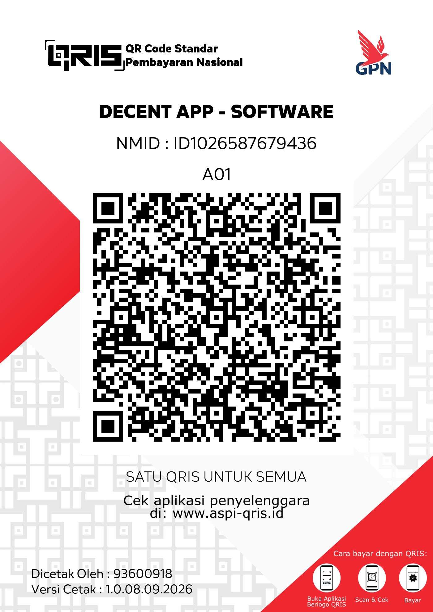

# DECENT

Hey, I'm Iqbal. I'm a UI/UX designer, not a developer — I have basically zero traditional coding background. This whole app was "vibe coded" (built almost entirely through AI-assisted development), because I mainly work in Figma and just wanted one clean, nice-looking place to actually showcase my portfolio, instead of scattered links and static PDFs.

It's a personal passion project. Expect rough edges, and feel free to poke around the source — nothing hidden.

## Features

- **Rich portfolio pages** — case studies, image galleries, Figma/prototype embeds, live links
- **Designer profiles** — bio, location, socials, followers/following
- **Discover & Search** — browse designers, search by name/tag/topic, trending keywords
- **Social layer** — like, follow, comment-free feed (For You + Circle)
- **Share anywhere** — QR codes and real shareable links (`/p/:id`, `/@handle`) with proper link previews on Discord/Twitter/etc.
- **Notifications** — real-time, with push support on native
- **Light/dark theme**, guest browsing (no account required to explore)
- **Cross-platform** — same codebase on web and Android

## Download

📱 **[Download the latest APK](https://expo.dev/artifacts/eas/hsSpPUbmSHZWYppzs8oeVkrB1pieMU04G9LT7N0CmmA.apk)**

This is a direct install (not on the Play Store yet), so Android will show an "unknown sources" prompt on first install — that's expected for any app installed outside the Play Store, not a warning specific to this app.

🌐 **[Try it on the web](https://decent-portfolio-decent6.vercel.app)** — no install needed.

## Tech Stack

React Native (Expo) · Supabase (auth, database, storage) · Vercel (web hosting) · Sentry (crash reporting)

## Status

Actively in development — expect frequent updates.

## Support

If you find this useful, a donation helps keep it running.

  

🇮🇩 **Indonesia:** scan the QRIS code above with any e-wallet or mobile banking app.
🌍 **International:** [Ko-fi](https://ko-fi.com/iputra07) — same option available in-app under Settings → Support & Donate.

## Verified Safe

✅ Scanned with [VirusTotal](https://www.virustotal.com/gui/file/1619a55e5888e33670ca8971424a32b930431362b3bb59b0166e0e85d04b49b5?nocache=1) — see the report for current detection results

Since this isn't distributed through the Play Store yet, Android's install prompt looks generic/unfamiliar — the scan above is independent, third-party confirmation this build is clean.

## Contact / Feedback

Found a bug, want a feature, or just have thoughts? Reach out directly:

- 📧 **Email:** [iputra07@gmail.com](mailto:iputra07@gmail.com)
